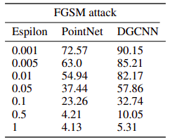

# Adversarial-Attacks-against-Point-clouds
# Adversial-Point-Cloud
### For FGSM attack on point net 
```cd PointNet/``` <br/>
```python3 fgsm_attack.py ``` <br/>
Run the python notebook ```pointnet_fgsm.ipynb```

### For running Saliency Map/FGSM on DGCNN
```cd DGCNN/``` <br/>
```python saurabh_dgcnn.py --exp_name=cls_1024_eval --eval=True --model_path=model.cls.1024.t7 --attack_type='jsma' --alpha=1 --kl=5 --num_drop=300```

<p align="center" width="100%">
    Saliency Map attack on airplane pointclouds with increasing number of points removed(0, 50, 100, 150, 200), and classes predicted by trained model
    
</p>

<p align="center" width="100%">
    FGSM on airplane pointclouds with increasing epsilon values (0, 0.001, 0.01, 0.1, 0.5), and classes predicted by trained model
    
</p>
<!--  <br/>
The accuracies of PointNet and DGCNN with respect to number of points removed for Saliency Map Attack -->

<p align="center" width="100%">
    The accuracies of PointNet and DGCNN wrt no of points removed for SMA
    
</p>

<p align="center" width="100%">
    The accuracies of PointNet and DGCNN wrt epsilon values for FGSM 
    
</p>
